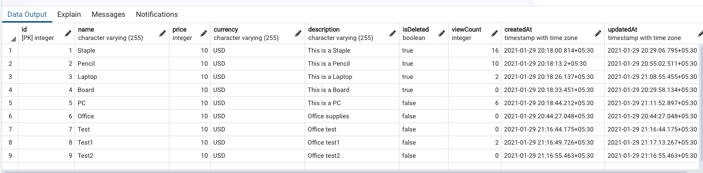

# Product Management

 

 
 

## Project setup
```
npm install
```

### Run
```
node server.js
```
### 

- Tools used

#### Code analyser : [ESlint](https://eslint.org/)

#### ORM :  [Sequelize](https://sequelize.org/)

#### Database : [PgAdmin](https://www.pgadmin.org/)

#### API testing tool : [Postman](https://www.postman.com/)

#### Unit Test : [Jest](https://jestjs.io/)

#### Third party libraries  used :  <a href="https://www.npmjs.com/package/@y2nk4/currency-converter" target="_blank">@y2nk4/currency-converter</a>

#### SQL Schema :[Product.sql](product.sql)

# REST API


The REST API to the product app is described below.

## Create a new product


### Request

`POST /products/`

     'Accept: application/json' http://localhost:9005/api/products

### Body

     {
        "name": "Banana",
        "price": 10,
        "description": "Banana supplies"
     }

### Response

    HTTP/1.1 200 OK
    Date: Thu, 24 Feb 2011 12:36:30 GMT
    Status: 200 OK
    Connection: close
    Content-Type: application/json
    Content-Length: 2

    {
        "id": 6,
        "name": "Banana",
        "price": 10,
        "currency": "USD",
        "description": "Banana supplies",
        "isDeleted": false,
        "viewCount": 0,
        "updatedAt": "2021-01-29T15:14:27.048Z",
        "createdAt": "2021-01-29T15:14:27.048Z"
    }


## Get list of Products

### Request

`GET /products/`

     'Accept: application/json' http://localhost:9005/api/products

### Response

    HTTP/1.1 200 OK
    Date: Thu, 24 Feb 2011 12:36:30 GMT
    Status: 200 OK
    Connection: close
    Content-Type: application/json
    Content-Length: 2

    [
    {
        "id": 1,
        "name": "Board",
        "price": 10,
        "currency": "USD",
        "description": "This is a Board",
        "isDeleted": false,
        "viewCount": 0,
        "createdAt": "2021-01-29T14:48:44.212Z",
        "updatedAt": "2021-01-29T14:48:44.212Z"
    },
    {
        "id": 2,
        "name": "Bond",
        "price": 10,
        "currency": "USD",
        "description": "This is a Bond",
        "isDeleted": false,
        "viewCount": 10,
        "createdAt": "2021-01-29T14:48:13.200Z",
        "updatedAt": "2021-01-29T15:06:15.708Z"
    }
]

## Get a single product

### Request

`GET /products/:id`

     'Accept: application/json' http://localhost:9005/api/products/1

### Response

    HTTP/1.1 200 OK
    Date: Thu, 24 Feb 2011 12:36:30 GMT
    Status: 200 OK
    Connection: close
    Content-Type: application/json
    Content-Length: 1

    {
        "id": 2,
        "name": "Bond",
        "price": 10,
        "currency": "USD",
        "description": "This is a Bond",
        "isDeleted": false,
        "viewCount": 11,
        "createdAt": "2021-01-29T14:48:13.200Z",
        "updatedAt": "2021-01-29T15:06:15.708Z"
    }

## List the most viewed products (will exclude deleted products & viewCount > 0 Order by DESC limit 5)

### Request

`GET /products/maxView/findByViewCount`

     'Accept: application/json' http://localhost:9005/api/products/maxView/findByViewCount

### Response

    HTTP/1.1 200 OK
    Date: Thu, 24 Feb 2011 12:36:30 GMT
    Status: 200 OK
    Connection: close
    Content-Type: application/json
    Content-Length: 1

    [
        {
            "id": 10,
            "name": "Pencil",
            "price": 10,
            "currency": "USD",
            "description": "This is a Pencil",
            "isDeleted": false,
            "viewCount": 10,
            "createdAt": "2021-01-29T14:48:13.200Z",
            "updatedAt": "2021-01-29T15:06:15.708Z"
        },
        {
            "id": 13,
            "name": "Pencil",
            "price": 10,
            "currency": "USD",
            "description": "This is a Pencil",
            "isDeleted": false,
            "viewCount": 7,
            "createdAt": "2021-01-29T14:48:13.200Z",
            "updatedAt": "2021-01-29T15:06:15.708Z"
        }
     ]

## Delete a product

### Request

`GET /products/:id`

     'Accept: application/json' http://localhost:9005/api/products/1

### Response
 
    {
        "message": "Product was deleted successfully!"
    }

## Get a product by passing custom currency and increment view-count 

### Request

`GET /products/:id/getProductByCurrency?currency=<CURRENCY>`

     'Accept: application/json' http://localhost:9005/api/products/5/getProductByCurrency?currency=INR

### Response
 
    {
        "id": 5,
        "name": "Board",
        "price": 728.61699,
        "currency": "INR",
        "description": "This is a Board",
        "isDeleted": false,
        "viewCount": 4,
        "createdAt": "2021-01-29T14:48:44.212Z",
        "updatedAt": "2021-01-29T15:38:37.056Z"
}


### When a list of the most viewed products is requested, the API should return the products with the highest view-counts. By default, the top 5 products will be returned, but the request can also specify a custom number of products to return. Only products with at least 1 view should be included. A specific currency can also be specified in which case all the prices should be returned in that currency.


### Request

`GET /products/maxView/findByViewCount?numberOfProducts=2&currency=INR`

     'Accept: application/json' http://localhost:9005/api/products/maxView/findByViewCount?numberOfProducts=2&currency=INR


### Response

    [
        {
            "id": 5,
            "name": "Board",
            "price": 10,
            "currency": "USD",
            "description": "This is a Board",
            "isDeleted": false,
            "viewCount": 6,
            "createdAt": "2021-01-29T14:48:44.212Z",
            "updatedAt": "2021-01-29T15:41:52.897Z"
        },
        {
            "id": 8,
            "name": "Test1",
            "price": 10,
            "currency": "USD",
            "description": "Office test1",
            "isDeleted": false,
            "viewCount": 2,
            "createdAt": "2021-01-29T15:46:49.726Z",
            "updatedAt": "2021-01-29T15:47:13.267Z"
        }
    ]


  
